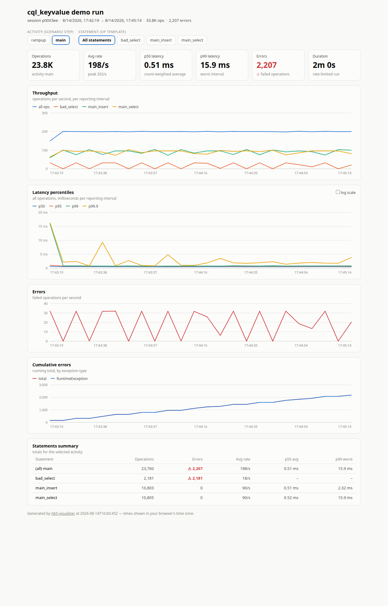
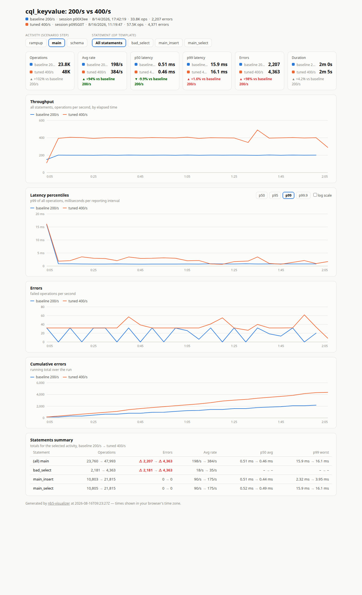

# NoSQLBench 5 Visualizer

[](https://github.com/eolivelli/nb5-visualizer/actions/workflows/ci.yml)
[](https://github.com/eolivelli/nb5-visualizer/releases)

Turn the metrics of a [NoSQLBench 5](https://github.com/nosqlbench/nosqlbench) (nb5)
CQL benchmark run into a **single, self-contained HTML report** with summaries and
time series:

- actual operation rate (throughput per reporting interval)
- latency percentiles (p50 / p95 / p99 / p99.9, linear or log scale)
- errors (rate, cumulative total, and per-exception-type breakdown)
- a selector to switch between **activities** (scenario steps such as `rampup` /
  `main`) and between the individual **statements** (op templates such as
  `main_select` / `main_insert`) of the run
- per-statement summary table (operations, errors, rates, latencies)

The report is one HTML file with no external resources — open it from disk, mail it,
or archive it next to the run logs. It follows your light/dark color scheme.



## Requirements

- **JDK 11 or newer** to run the visualizer (the core CLI is a plain executable jar
  with zero runtime dependencies; the TUI and CLI jars are equally self-contained,
  with the [Lanterna](https://github.com/mabe02/lanterna) terminal library and/or
  [Apache Mina SSHD](https://mina.apache.org/sshd-project/) bundled in).
- NoSQLBench **5.25+** (the current `nosqlbench/nosqlbench` Docker image or a recent
  `nb5` binary). This tool reads the labeled CSV metrics introduced with nb5's
  snapshot-based metrics system; the old dotted metric names of nb5 5.17/5.21 are
  not supported.

## Get it

Download the jars from the [GitHub releases](https://github.com/eolivelli/nb5-visualizer/releases)
— both are self-contained, `java -jar` is all you need:

| Jar | What it does |
|---|---|
| `nb5-visualizer-tui-<version>.jar` | **Recommended.** Everything: the interactive terminal UI, the command line, and SSH support for remote runs. |
| `nb5-visualizer-cli-<version>.jar` | Headless command line with SSH support — no terminal UI. |
| `nb5-visualizer-core-<version>.jar` | Minimal command line only, zero dependencies, local files only. |

Or build from source:

```bash
mvn package
# -> nb5-visualizer-core/target/nb5-visualizer-core-<version>.jar   (CLI, zero deps)
# -> nb5-visualizer-cli/target/nb5-visualizer-cli-<version>.jar     (CLI + SSH)
# -> nb5-visualizer-tui/target/nb5-visualizer-tui-<version>.jar     (TUI + CLI + SSH)
```

The examples below use the paths of a source build; with a downloaded jar just
substitute its filename.

In a checkout you can also use the launcher scripts in the repository root —
they find the jar wherever the build put it (and build it first if needed):

```bash
./nb5-visualizer.sh out -o report.html      # CLI (cli jar, takes the SSH flags too)
./nb5-visualizer-tui.sh                     # TUI (also takes all CLI/SSH flags)
```

## 1. Run NoSQLBench so it produces input for the visualizer

The visualizer reads the directory written by nb5's `--report-csv-to` option: one CSV
file per metric plus a `metrics-files.jsonl` manifest that maps each file to its
metric name, type and labels (activity, op, …).

The options that matter:

| Option / parameter | Why |
|---|---|
| `--report-csv-to <dir>:<regex>:<interval>` | Writes the per-metric CSVs. The third, colon-separated field is the reporting cadence as a duration (`5s`, `10s`, `1m`); the default is 30s. Note: `--report-interval` does **not** control this. |
| `instrument=true` (activity parameter) | Emits per-statement timers (`successfor_<op>` / `errorsfor_<op>`), which power the per-statement selector and table. Without it you still get per-activity charts. |
| `errors=counter,warn` (activity parameter) | Keeps the run going on statement errors and counts them per exception type (default is `errors=stop`). Enables the per-exception-type error chart. |

### Example: bundled key-value workload against Cassandra 5, everything in Docker

```bash
docker network create nb5net
docker run -d --name cassandra --network nb5net cassandra:5
# wait until: docker exec cassandra cqlsh -e 'describe cluster' succeeds

mkdir -p out
docker run --rm --network nb5net -v "$PWD/out:/out" -w /out \
  --entrypoint java nosqlbench/nosqlbench:latest \
  --enable-preview -XX:+UseZGC -jar /nb5.jar \
  cql_keyvalue default hosts=cassandra localdc=datacenter1 \
  rampup-cycles=100000 main-cycles=1000000 threads=auto \
  instrument=true errors=counter,warn \
  --report-csv-to '/out/csv:.*:5s' \
  --report-summary-to /out/summary.txt
```

(The entrypoint override pins the working directory so nb5's `logs/` also lands in
`out/`; a plain `docker run --rm --network nb5net -v "$PWD/out:/out" nosqlbench/nosqlbench:latest cql_keyvalue ... --report-csv-to '/out/csv:.*:5s'`
works too. The container writes as root — `sudo chown -R "$USER" out` afterwards if
needed.)

### Example: nb5 binary against an existing cluster

```bash
nb5 cql_keyvalue default hosts=10.0.0.5 localdc=dc1 \
  rampup-cycles=1000000 main-cycles=10000000 threads=auto cyclerate=20000 \
  instrument=true errors=counter,warn \
  --report-csv-to 'metrics/csv:.*:5s'
```

### Example: the demo workload of this repository

[`examples/nb5viz_demo.yaml`](examples/nb5viz_demo.yaml) is a key-value workload
(based on nb5's `cql_keyvalue` baseline) whose `witherrors` scenario adds a
statement that fails on every execution, so you can see the error charts in action:

```bash
docker run --rm --network nb5net -v "$PWD/out:/out" -v "$PWD/examples:/workloads" -w /out \
  --entrypoint java nosqlbench/nosqlbench:latest \
  --enable-preview -XX:+UseZGC -jar /nb5.jar \
  /workloads/nb5viz_demo.yaml witherrors \
  hosts=cassandra localdc=datacenter1 \
  rampup-cycles=10000 main-cycles=24000 cyclerate=200 \
  instrument=true errors=counter,warn \
  --report-csv-to '/out/csv:.*:5s'
```

## 2. Generate the report (CLI)

```bash
java -jar nb5-visualizer-core/target/nb5-visualizer-core-*.jar out \
  -o report.html --title "cql_keyvalue baseline"
```

(The TUI jar accepts exactly the same arguments — any argument makes it behave
as the plain CLI.)

The input is the CSV directory itself (`out/csv`), its parent (`out`), or a
**`.zip` archive** of either — handy when someone mails you the metrics of a run.
Then open `report.html` in a browser.

```
Usage: java -jar nb5-visualizer.jar <metrics-dir> [options]
       java -jar nb5-visualizer.jar <run-a> <run-b> [options]
  -o, --output    output HTML file (default: nb5-report.html)
  --title         report title
  --labels        names for the two compared runs, e.g. --labels "baseline,tuned"
                  (default: directory/archive names)
```

## Interactive terminal UI (TUI)

If you'd rather browse to the metrics than type paths, run the TUI jar with no
arguments:

```bash
java -jar nb5-visualizer-tui/target/nb5-visualizer-tui-*.jar
```

A full-screen form opens in the terminal: pick **Run A** (and optionally **Run B**
for a comparison) with the built-in file browser — arrow keys navigate, Enter
descends into a directory or picks a `.zip` archive, and *Choose this directory*
selects the directory being shown. Set the output file and an optional title, then
*Generate report*; the TUI offers to open the finished report in your browser.

The same jar doubles as the CLI: any command-line argument makes it behave exactly
like the core jar (`java -jar nb5-visualizer-tui-*.jar out -o report.html`) — with
one addition, the `--ssh` flags described in the next section. It works in any
ANSI terminal; launched without one (e.g. double-clicked from a file manager) it
falls back to a Swing terminal window.

Bundled third-party libraries: Lanterna (LGPL-3.0, source at the link above),
Apache Mina SSHD (Apache-2.0), and net.i2p.crypto eddsa (CC0).

## Remote runs over SSH

If the benchmark ran on a machine you reach via SSH, the TUI and CLI jars can
use the files over there directly — no manual copying. Add `--ssh` (the
connection is opened once, at launch):

```bash
# interactive TUI: the file browser walks the remote filesystem
java -jar nb5-visualizer-tui/target/nb5-visualizer-tui-*.jar --ssh me@bench-host

# headless CLI: input paths refer to the remote machine (relative to the
# remote home) — the TUI jar accepts the same arguments
java -jar nb5-visualizer-cli/target/nb5-visualizer-cli-*.jar \
  --ssh me@bench-host:2222 -i ~/.ssh/id_ed25519 \
  bench/out-baseline bench/out-tuned --labels "baseline,tuned" -o compare.html
```

- Authentication is publickey-only: `-i/--identity <file>`, defaulting to
  `~/.ssh/id_ed25519`, `id_rsa` or `id_ecdsa` (passphrase prompted if needed).
- `--remote-dir <path>` sets the initial directory on the remote machine: the
  TUI file browser starts there and relative CLI input paths resolve against
  it (default: the remote home; a relative value resolves against the home).
  With it, the CLI example above becomes
  `--ssh me@bench-host --remote-dir bench out-baseline out-tuned …`.
- `-v/--verbose` logs the SSH progress to stderr — connecting, authentication,
  directory walking, and every file download with size and timing — useful when
  a transfer looks stuck. (In the TUI it covers the connect phase only.)
- Host keys are checked against `~/.ssh/known_hosts` with accept-new semantics:
  unknown hosts show their fingerprint and are remembered after you confirm;
  a **changed** key is always rejected.
- Selected inputs (metrics directories or `.zip` archives) are fetched to a
  local temp directory, deleted on exit; the HTML report is always written
  locally. The SSH support (Apache Mina SSHD) is bundled in the TUI and CLI
  jars — the core jar stays dependency-free and local-only.

## Comparing two runs

Pass two inputs (directories or zips, in any mix) to get a comparison report of
two runs of the same workload — for example a baseline and a run with different
settings:

```bash
java -jar nb5-visualizer-core/target/nb5-visualizer-core-*.jar baseline-out tuned-out \
  --labels "baseline,tuned" -o compare.html
```

The comparison matches activities and statements **by name** and overlays the two
runs on every chart, with time normalized to *elapsed time from activity start*
(so runs recorded at different wall-clock times, or of different lengths, line
up). Summary tiles show both values plus the relative delta, colored by whether
the change is an improvement (throughput up = good, latency/errors up = bad); the
latency chart gets a percentile picker (p50/p95/p99/p99.9, one line per run); and
the statements table shows `A → B` for every figure. A warning banner appears if
the two runs came from different workload files.



## What the report shows

- **Activity selector** — one entry per nb5 activity (each scenario step: `schema`,
  `rampup`, `main`, …). Activities shorter than one reporting interval (typically
  the `schema` step) produce no samples and are omitted.
- **Statement selector** — per op template, from the `instrument=true` metrics.
  "All statements" shows the whole activity plus one throughput line per statement.
- **Throughput** — interval op counts divided by the interval length (attempts,
  i.e. successes + errors).
- **Latency percentiles** — from nb5's `result_success` timer (successful ops), or
  `successfor_<op>` for a single statement. Each point is the distribution *within
  that reporting interval* (delta HDR reservoir), in milliseconds. Intervals with
  no operations show gaps, not zeros.
- **Errors** — per-interval error rate from the cumulative `errors_total` gauge
  (activity) or the `errorsfor_<op>` timer (statement), plus the cumulative curve
  broken down by exception type when the run used `errors=counter`.

## Development

```bash
mvn test                 # unit tests: recorded real nb5 output, plus the SSH
                         #   feature tested against an in-JVM Mina SSH server
mvn verify -Pdocker-it   # + integration tests: full Cassandra 5 + nb5 run in
                         #   Docker, and a JDK-11-only runtime check of the jar
```

The Docker integration tests pull `cassandra:5`, `nosqlbench/nosqlbench:latest`,
`eclipse-temurin:11-jre` and `alpine` on first use; everything else (including
the SSH tests) runs without Docker.

The project is a four-module Maven build: `nb5-visualizer-core` (parser,
analyzer, HTML generator, CLI — no runtime dependencies), `nb5-visualizer-ssh`
(the shared SSH/SFTP support on Apache Mina SSHD), `nb5-visualizer-cli`
(core + SSH shaded into a headless self-contained jar) and `nb5-visualizer-tui`
(the Lanterna-based terminal UI on top of the same pieces). CI builds on
JDK 11/17/21; pushing a `v*` tag builds and attaches the jars to a GitHub
release (`v0.x` and `-rc` tags are marked pre-release).

The test fixtures in `nb5-visualizer-core/src/test/resources/fixtures/` are unmodified output of real
nb5 runs against Cassandra 5 (`run-witherrors` and `run-witherrors-b` were
produced by the demo workload above at 200/s and 400/s — the pair behind the
comparison screenshot; `run-short` is a run shorter than the reporting interval,
i.e. a single snapshot).

## Input format notes (for the curious)

- `metrics-files.jsonl` — append-only JSONL manifest; one object per metric
  instance: `{"metric","labels":{...},"file","first_seen_ms","type"}`. Filenames
  are derived from a per-snapshot label diff and are **not stable**; the manifest
  is the source of truth (the visualizer only falls back to filenames when no
  manifest is present).
- Per-metric CSVs, first column `t` = epoch seconds:
  - timer: `t,count,max,mean,min,stddev,p50,p75,p95,p98,p99,p999,mean_rate,m1_rate,m5_rate,m15_rate,rate_unit,duration_unit` (durations in nanoseconds)
  - histogram: `t,count,max,mean,min,stddev,p50,p75,p95,p98,p99,p999`
  - meter: `t,count,mean_rate,m1_rate,m5_rate,m15_rate,rate_unit`
  - gauge: `t,value`
- `count` is per reporting interval; `errors_total` is cumulative;
  `errors_<ExceptionType>` gauges appear with `errors=counter`.

## License

[Apache License 2.0](LICENSE)
